# Express Market Web — CheckPoint 4 (Parte II) | Java Advanced

Aplicação web desenvolvida com Spring MVC, Thymeleaf e Spring Security para gerenciamento do estoque de um mercado express, como parte do CheckPoint 4 — Parte II da disciplina de Java Advanced (TDS) — FIAP.

Este projeto reutiliza a mesma tabela Oracle (`TDS_TB_mercado`) construída na [Parte I](https://github.com/3BugBuddies/cp4-express-market) (API REST), mas expõe o CRUD de produtos através de páginas HTML autenticadas, em vez de endpoints JSON.

---

## Deploy

| Recurso | URL |
|---------|-----|
| Deploy (Render) | https://cp4-express-market-web.onrender.com/ |
| Login | https://cp4-express-market-web.onrender.com/login |

> O plano gratuito do Render hiberna o serviço após ~15 min de inatividade. O primeiro acesso após esse período pode levar de 30 a 50 segundos para responder.

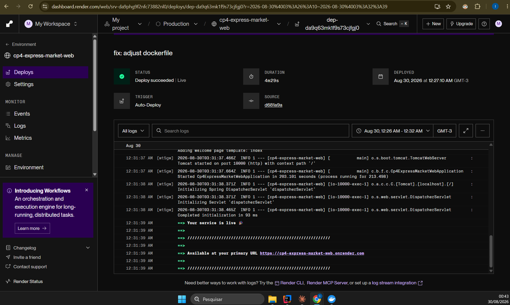

---

## Integrantes do Grupo

| Nome | RM |
|------|----|
| Felipe Yuiti Ishii | 565339 |
| Gabriel Nogueira Peixoto | 563925 |
| Giovanna Neri dos Santos | 566154 |
| Mariana Inoue | 565834 |

**IDE utilizada:** IntelliJ IDEA

---

## Configuração do Projeto — Spring Initializr

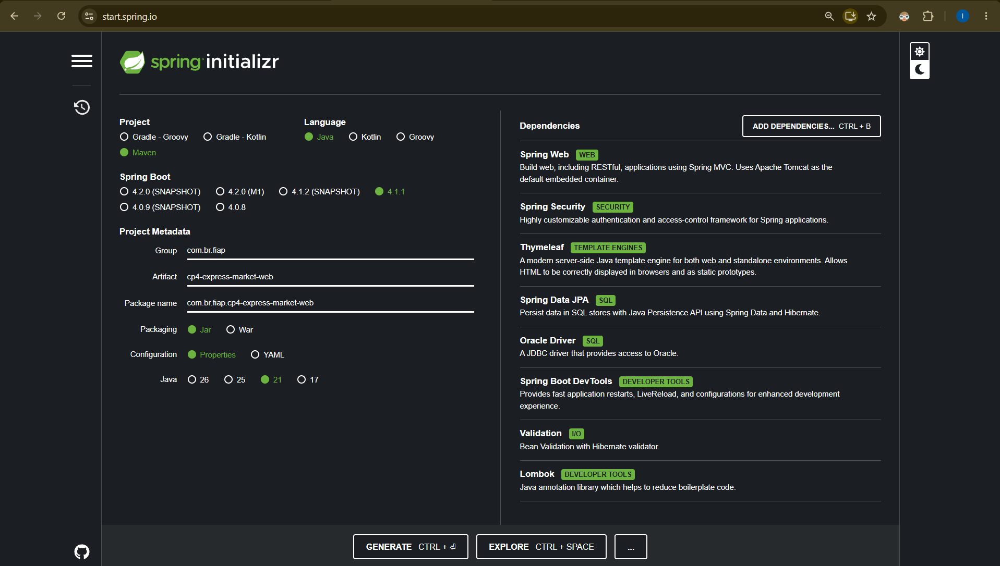

### Dependências

| Dependência | Categoria | Descrição |
|-------------|-----------|-----------|
| Spring Web | WEB | Criação da camada MVC (controllers, dispatcher servlet) |
| Spring Security | SECURITY | Autenticação por formulário, autorização por rota, logout |
| Thymeleaf | WEB | Motor de templates server-side para renderização das views |
| Spring Data JPA | SQL | Persistência com JPA e Hibernate |
| Validation | I/O | Bean Validation com Hibernate Validator |
| Lombok | Developer Tools | Redução de boilerplate (getters, setters, construtores) |
| Oracle Driver | SQL | Driver JDBC para Oracle Database |
| Spring Boot DevTools | Developer Tools | LiveReload e reinicialização automática |

> Em relação à Parte I, esta versão **remove** Spring HATEOAS e SpringDoc OpenAPI (exclusivos de API REST) e **adiciona** Spring Security e Thymeleaf, exigidos para a camada web autenticada.

---

## Estrutura do Projeto

```
src/
├── main/
│   ├── java/com/br/fiap/cp4_express_market_web/
│   │   ├── Cp4ExpressMarketWebApplication.java   # Classe principal
│   │   ├── config/
│   │   │   └── SecurityConfig.java               # Regras de autenticação e autorização
│   │   ├── controller/
│   │   │   └── ProdutoViewController.java        # Rotas MVC (retornam views, não JSON)
│   │   ├── dto/
│   │   │   └── ProdutoRequest.java               # Vínculo do formulário HTML + validação
│   │   ├── entity/
│   │   │   └── Produto.java                      # Entidade JPA (mesma tabela da Parte I)
│   │   ├── exception/
│   │   │   └── NotFoundException.java            # Lançada quando um produto não existe
│   │   ├── repository/
│   │   │   └── ProdutoRepository.java            # Interface de acesso a dados
│   │   └── service/
│   │       └── ProdutoService.java               # Regras de negócio (sem PATCH, fluxo web)
│   └── resources/
│       ├── static/
│       │   └── css/
│       │       └── style.css                     # Estilo compartilhado entre as views
│       ├── templates/
│       │   ├── index.html                        # Landing page pública
│       │   ├── login.html                        # Formulário de login customizado
│       │   ├── market.html                       # Listagem de produtos (área autenticada)
│       │   └── produto-form.html                 # Formulário de criação/edição
│       └── application.properties                # Configurações da aplicação
├── Dockerfile                                     # Build multi-stage para deploy no Render
└── application-local.properties / .env            # Credenciais locais (fora do controle de versão)
```

---

## Por que Controller MVC e não REST Controller?

Na Parte I, o `ProdutoController` é anotado com `@RestController` e devolve JSON, consumido por clientes HTTP (Postman, front-ends externos).

Aqui, o `ProdutoViewController` é anotado com `@Controller` e cada método devolve o **nome de uma view** Thymeleaf (ex: `"market"` → `templates/market.html`), populando um `Model` com os dados a serem exibidos. É o navegador quem consome essas páginas diretamente, não um cliente de API.

Pelo mesmo motivo, os DTOs foram simplificados: `ProdutoResponse` e `ProdutoPatchRequest` (usados na Parte I para moldar JSON e atualizações parciais via API) não fazem sentido aqui — o Thymeleaf usa a entidade `Produto` direto no `Model`, e o formulário HTML sempre envia todos os campos de uma vez (por isso o service não implementa `patch`, apenas `update`).

---

## Como Executar

### Pré-requisitos

- Java 21+
- Maven 3.9+ (ou o `./mvnw` incluído no repositório)
- Credenciais do Oracle da FIAP

### Rodando a aplicação

```bash
# Clonar o repositório
git clone https://github.com/3BugBuddies/cp4-express-market-web.git

# Entrar na pasta do projeto
cd cp4-express-market-web

# Configurar as credenciais do Oracle
# (ver a seção "Configuração de Variáveis de Ambiente" abaixo)

# Executar com Maven
./mvnw spring-boot:run
```

A aplicação sobe em `http://localhost:8083`. Abra `http://localhost:8083/` no navegador e entre com as credenciais da seção "Credenciais de Teste".

---

## Segurança — Spring Security

### Regras de autorização (`SecurityConfig`)

| Rota | Acesso |
|------|--------|
| `/`, `/login` | Pública |
| `/css/**`, `/js/**`, `/images/**` | Pública (recursos estáticos) |
| `/logout` | Pública |
| `/market/**` | Autenticado |
| Qualquer outra rota | Autenticado |

### Fluxo de autenticação

- **Login:** formulário customizado em `/login` (`login.html`), com feedback visual de erro (`?error`) e de logout (`?logout`)
- **Sucesso no login:** redireciona para `/market`
- **Logout:** limpa a sessão e redireciona para `/`
- **Usuário:** autenticação em memória via `spring.security.user.name` / `spring.security.user.password`, configurados por variável de ambiente (ver seção de configuração abaixo)

---

## Configuração de Variáveis de Ambiente

Nenhuma credencial fica em texto puro no repositório. Todas são resolvidas via variáveis de ambiente:

```properties
spring.datasource.url=${ORACLE_URL}
spring.datasource.username=${ORACLE_USER}
spring.datasource.password=${ORACLE_PASSWORD}

spring.security.user.name=${ADMIN_USER}
spring.security.user.password=${ADMIN_PASSWORD}
```

| Variável | Descrição |
|----------|-----------|
| `ORACLE_URL` | String de conexão JDBC com o Oracle da FIAP |
| `ORACLE_USER` | RM do integrante dono do schema |
| `ORACLE_PASSWORD` | Senha do Oracle |
| `ADMIN_USER` | Usuário de login da aplicação web |
| `ADMIN_PASSWORD` | Senha de login da aplicação web |
| `PORT` | Porta HTTP (injetada automaticamente pelo Render; local usa `8083` por padrão) |

### Rodando localmente

Crie um arquivo `application-local.properties` em `src/main/resources/` (já ignorado pelo Git) com os valores reais:

```properties
ORACLE_URL=jdbc:oracle:thin:@oracle.fiap.com.br:1521:ORCL
ORACLE_USER=<SEU_RM>
ORACLE_PASSWORD=<SUA_SENHA>
ADMIN_USER=<usuario_desejado>
ADMIN_PASSWORD=<senha_desejada>
```

E ative o perfil `local` ao rodar:

```bash
./mvnw spring-boot:run -Dspring-boot.run.profiles=local
```

A aplicação sobe em `http://localhost:8083`.

---

## Credenciais de Teste

Para acessar a aplicação (login obrigatório):

| Campo | Valor |
|-------|-------|
| **Usuário** | `Tranquilo` |
| **Senha** | `123` |

Essas credenciais estão configuradas no `application.properties` via variáveis de ambiente (`${ADMIN_USER}` e `${ADMIN_PASSWORD}`), tanto em ambiente local quanto no deploy no Render.

---

## Rodando com Docker

O projeto inclui um `Dockerfile` multi-stage (build com Maven + Java 21, execução com JRE 21).

```bash
# Build da imagem
docker build -t cp4-express-market-web .

# Execução (usando um arquivo .env com as variáveis acima)
docker run -p 8083:8083 --env-file .env cp4-express-market-web
```

---

## Deploy no Render

1. Repositório conectado ao Render como **Web Service**
2. **Runtime:** Docker (o Render não oferece runtime nativo Java; o `Dockerfile` do projeto cuida do build)
3. Variáveis de ambiente cadastradas em **Settings → Environment**: `ORACLE_URL`, `ORACLE_USER`, `ORACLE_PASSWORD`, `ADMIN_USER`, `ADMIN_PASSWORD`
4. Deploy automático a cada `git push` na branch `main`

---

## Modelo de Dados

A aplicação usa a **mesma tabela** da Parte I, como o enunciado sugere ("utilizar o mesmo BD da Parte I"). Assim, um produto cadastrado pela API REST aparece nesta interface web, e vice-versa.

### Diagrama de Classe


### Entidade `Produto`

Tabela Oracle: `TDS_TB_mercado` | Sequence: `SQ_TDS_TB_mercado`

| Campo | Coluna | Tipo | Validações |
|-------|--------|------|-----------|
| id | id_produto | Long (PK) | Gerado pela sequence |
| nome | nm_nome_produto | String | Obrigatório, 3–50 caracteres |
| tipo | tp_tipo | String | Obrigatório, 3–50 caracteres |
| setor | st_setor | String | Obrigatório, 3–50 caracteres |
| tamanho | tm_tamanho | String | Obrigatório, 2–50 caracteres |
| preco | pr_preco | Double | Obrigatório, valor positivo |

### Print do Banco de Dados

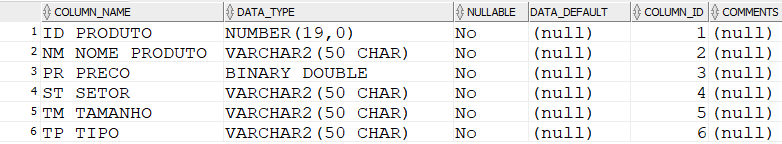

---

## Fluxo de Telas

| Rota | Descrição |
|------|-----------|
| `GET /` | Landing page pública, com botão de acesso ao login |
| `GET /login` | Formulário de login |
| `GET /market` | Lista todos os produtos cadastrados (autenticado) |
| `GET /market/novo` | Formulário de cadastro de novo produto |
| `POST /market/novo` | Persiste o novo produto e redireciona para `/market` |
| `GET /market/editar/{id}` | Formulário pré-preenchido para edição |
| `POST /market/editar/{id}` | Atualiza o produto e redireciona para `/market` |
| `POST /market/excluir/{id}` | Remove o produto (com confirmação no navegador) e redireciona para `/market` |
| `POST /logout` | Encerra a sessão e redireciona para `/` |

Validações de formulário (`@Valid` + `BindingResult`) reaproveitam as mesmas regras de negócio da Parte I (nome e tipo entre 3–50 caracteres, tamanho entre 2–50, preço positivo obrigatório) e exibem a mensagem de erro abaixo do campo correspondente, sem sair da página do formulário.

---

## Demonstração Visual

Prints na ordem em que o fluxo acontece no navegador. Os que mostram a barra de endereço foram tirados no deploy do Render; os demais, na aplicação rodando localmente sobre a mesma tabela.

### 1. Página inicial (pública)

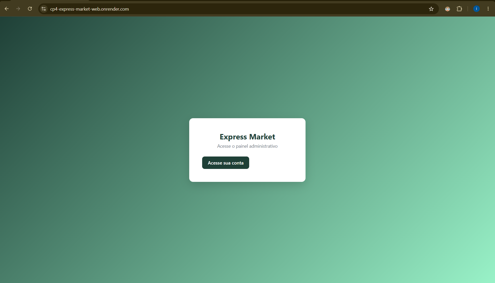

Única tela acessível sem login, com o botão que leva ao formulário de autenticação.

### 2. Rota privada sem sessão

Qualquer acesso direto a `/market` sem estar logado é interceptado pelo Spring Security e redirecionado para `/login`.

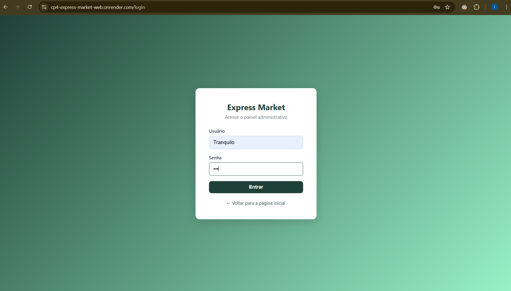

Credenciais de teste: `Tranquilo` / `123`.

### 3. Login com credenciais inválidas

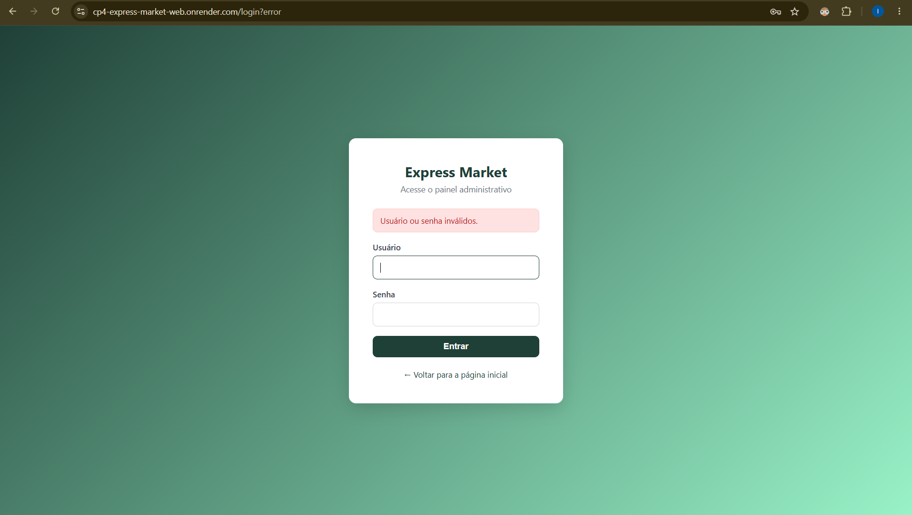

O Spring Security devolve para `/login?error` e o template exibe o alerta.

### 4. Listagem de produtos (Read)

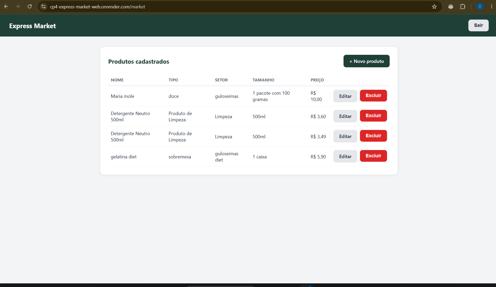

Painel autenticado com todos os registros de `TDS_TB_mercado`, botão "Novo produto" e ações de editar e excluir por linha. Os mesmos produtos aparecem na API da Parte I, porque a tabela é compartilhada.

### 5. Novo produto (Create)

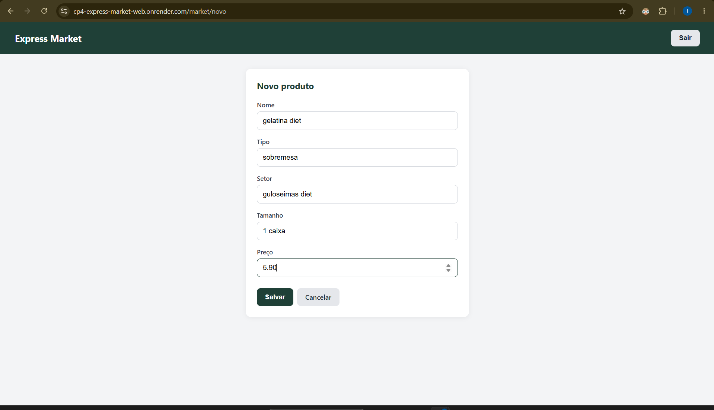

### 6. Validação do formulário

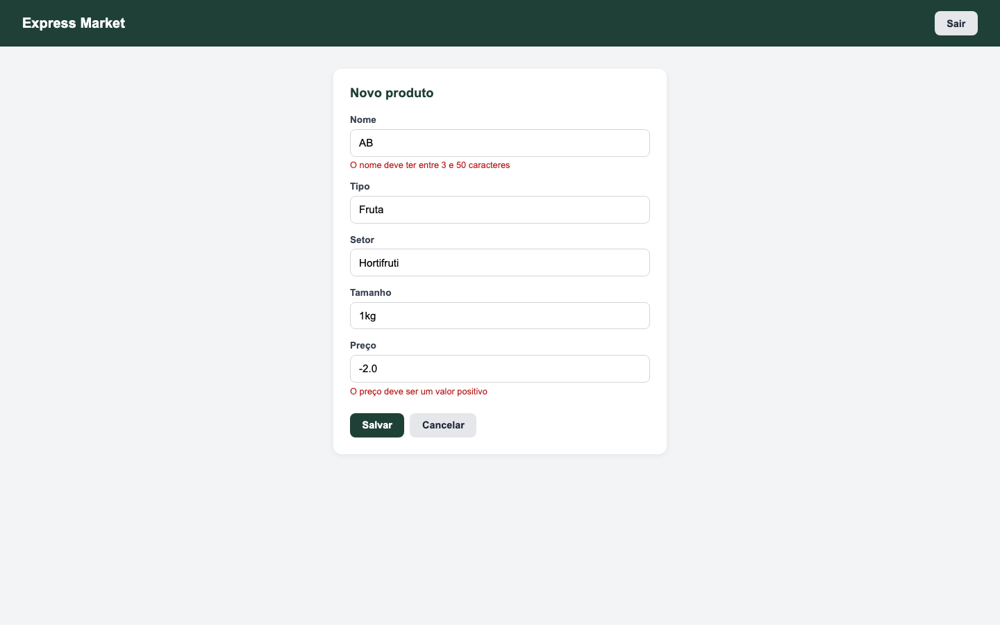

Bean Validation no servidor (`@Valid` + `BindingResult`): nome com menos de 3 caracteres e preço negativo são rejeitados, e a mensagem de cada campo aparece abaixo dele, sem sair do formulário.

### 7. Produto criado

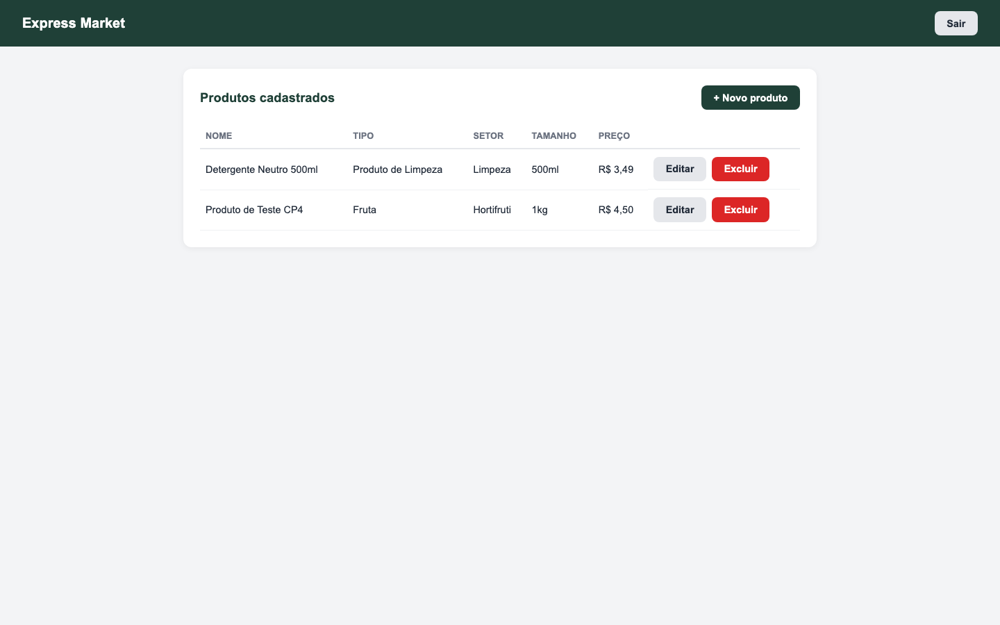

Após o `POST /market/novo`, o controller redireciona para `/market` e o novo registro aparece na tabela.

### 8. Editar produto (Update)

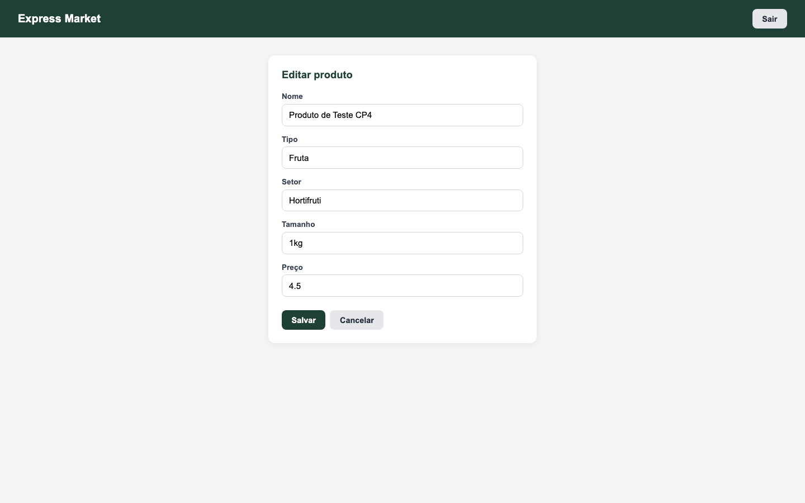

Mesmo template do cadastro, pré-preenchido com os dados do banco; o envio vai para `POST /market/editar/{id}`.

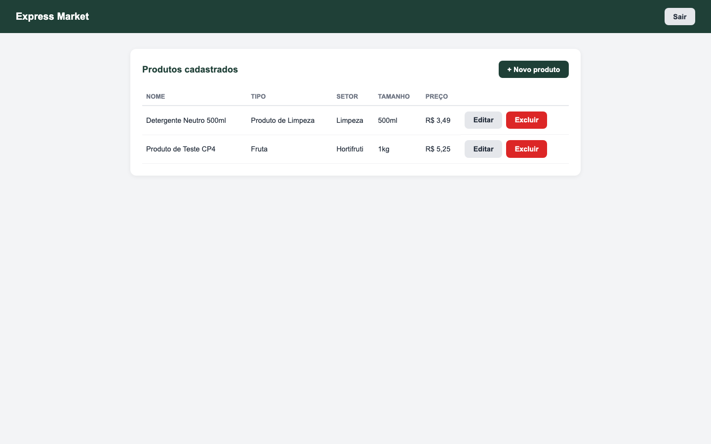

### 9. Excluir produto (Delete)

O botão "Excluir" pede confirmação no navegador (`confirm()`). Confirmado, o `POST /market/excluir/{id}` remove o registro e volta para a lista.

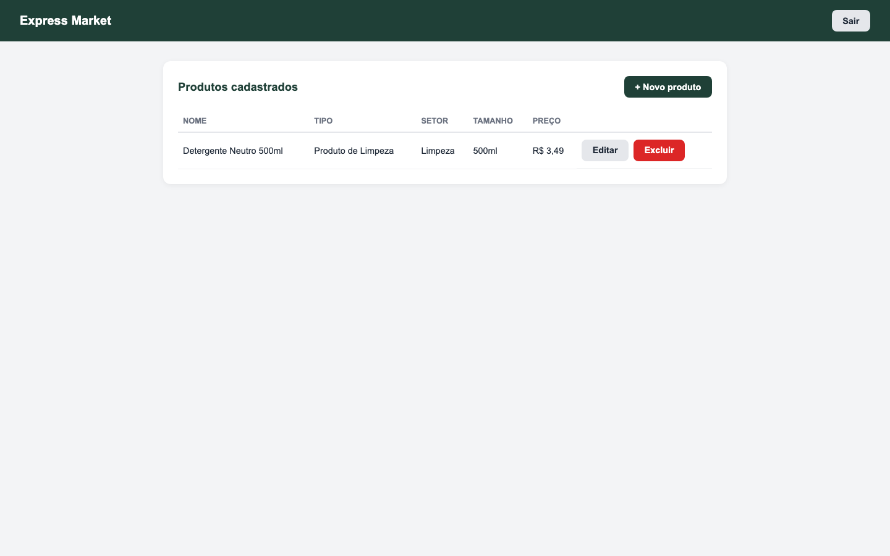

### 10. Logout

O botão "Sair" encerra a sessão e volta para a página inicial pública. Uma nova tentativa de abrir `/market` cai de novo no login.

---

## Tecnologias Utilizadas

- **Java 21**
- **Spring Boot 4.1.1**
- **Spring MVC**
- **Spring Security** (form login + autorização por rota)
- **Thymeleaf**
- **Spring Data JPA + Hibernate**
- **Bean Validation (Hibernate Validator)**
- **Lombok**
- **Oracle Database (OJDBC 17)**
- **Docker** (multi-stage build)
- **Maven**
- **Render** (deploy)
