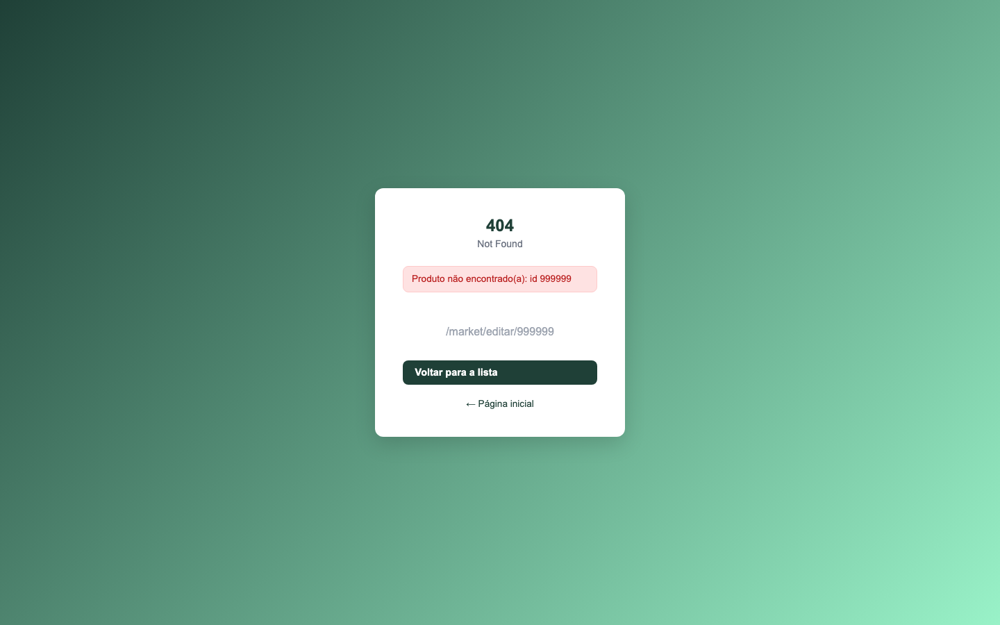
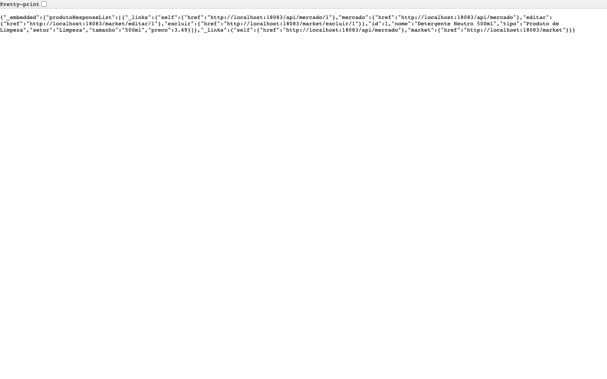
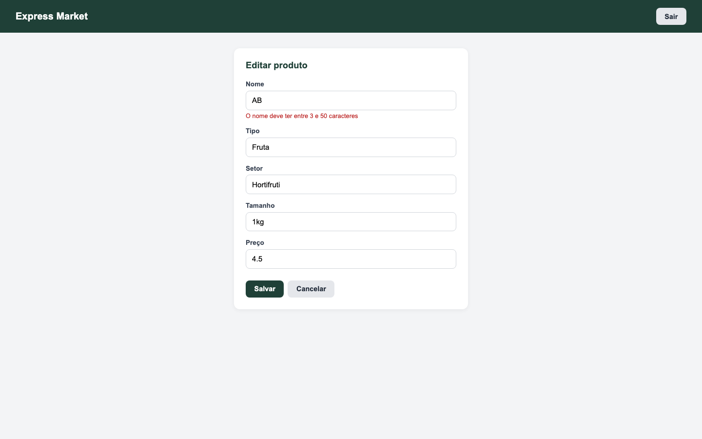

# Express Market Web — CheckPoint 4 (Parte II) | Java Advanced

Aplicação web desenvolvida com Spring MVC, Thymeleaf e Spring Security para gerenciamento do estoque de um mercado express, como parte do CheckPoint 4 — Parte II da disciplina de Java Advanced (TDS) — FIAP.

Este projeto reutiliza a mesma tabela Oracle (`TDS_TB_mercado`) construída na [Parte I](https://github.com/3BugBuddies/cp4-express-market) (API REST), mas expõe o CRUD de produtos através de páginas HTML autenticadas, em vez de endpoints JSON.

---

## Deploy

| Recurso | URL |
|---------|-----|
| Deploy (Render) | https://cp4-express-market-web.onrender.com/ |
| Login | https://cp4-express-market-web.onrender.com/login |

> O plano gratuito do Render hiberna o serviço após ~15 min de inatividade. O primeiro acesso após esse período pode levar de 30 a 50 segundos para responder.


---

## Integrantes do Grupo

| Nome | RM |
|------|----|
| Felipe Yuiti Ishii | 565339 |
| Gabriel Nogueira Peixoto | 563925 |
| Giovanna Neri dos Santos | 566154 |
| Mariana Inoue | 565834 |

**IDE utilizada:** IntelliJ IDEA

---

## Configuração do Projeto — Spring Initializr


### Dependências

| Dependência | Categoria | Descrição |
|-------------|-----------|-----------|
| Spring Web | WEB | Criação da camada MVC (controllers, dispatcher servlet) |
| Spring Security | SECURITY | Autenticação por formulário, autorização por rota, logout |
| Thymeleaf | WEB | Motor de templates server-side para renderização das views |
| thymeleaf-extras-springsecurity6 | WEB | Integração do Thymeleaf com o contexto de segurança (tags `sec:*`) |
| Spring Data JPA | SQL | Persistência com JPA e Hibernate |
| Validation | I/O | Bean Validation com Hibernate Validator |
| Lombok | Developer Tools | Redução de boilerplate (getters, setters, construtores) |
| Oracle Driver | SQL | Driver JDBC para Oracle Database |
| Spring Boot DevTools | Developer Tools | LiveReload e reinicialização automática |
| Spring HATEOAS | WEB | Links de navegação nas respostas JSON e nos botões das views (maturidade nível 3) |

> Em relação à Parte I, esta versão **remove** o SpringDoc OpenAPI, **mantém** o Spring HATEOAS (agora alimentando os botões das views e um endpoint JSON de consulta) e **adiciona** Spring Security e Thymeleaf, exigidos para a camada web autenticada.

---

## Estrutura do Projeto

```
src/
├── main/
│   ├── java/com/br/fiap/cp4_express_market_web/
│   │   ├── Cp4ExpressMarketWebApplication.java   # Classe principal
│   │   ├── assembler/
│   │   │   └── ProdutoModelAssembler.java        # Monta os links HATEOAS (views e JSON)
│   │   ├── config/
│   │   │   └── SecurityConfig.java               # Regras de autenticação e autorização
│   │   ├── controller/
│   │   │   ├── ProdutoViewController.java        # Rotas MVC (retornam views, não JSON)
│   │   │   └── ProdutoApiController.java         # Consulta JSON com HATEOAS (/api/mercado)
│   │   ├── dto/
│   │   │   ├── ProdutoRequest.java               # Vínculo do formulário HTML + validação
│   │   │   └── ProdutoResponse.java              # Conteúdo embrulhado pelo assembler
│   │   ├── entity/
│   │   │   └── Produto.java                      # Entidade JPA (mesma tabela da Parte I)
│   │   ├── exception/
│   │   │   └── NotFoundException.java            # Lançada quando um produto não existe
│   │   ├── handler/
│   │   │   ├── GlobalExceptionHandler.java       # Traduz NotFoundException na página de erro 404
│   │   │   ├── ApiExceptionHandler.java          # Mesma exceção em JSON, só para o endpoint /api
│   │   │   └── ErrorResponse.java                # Corpo das respostas de erro em JSON
│   │   ├── repository/
│   │   │   └── ProdutoRepository.java            # Interface de acesso a dados
│   │   └── service/
│   │       └── ProdutoService.java               # Regras de negócio (sem PATCH, fluxo web)
│   └── resources/
│       ├── static/
│       │   └── css/
│       │       └── style.css                     # Estilo compartilhado entre as views
│       ├── templates/
│       │   ├── index.html                        # Landing page pública
│       │   ├── login.html                        # Formulário de login customizado
│       │   ├── market.html                       # Listagem de produtos (área autenticada)
│       │   ├── produto-form.html                 # Formulário de criação/edição
│       │   └── error.html                        # Página de erro (404 e demais falhas)
│       └── application.yml                       # Configurações da aplicação em YAML (com defaults)
├── Dockerfile                                     # Build multi-stage para deploy no Render
└── .gitignore                                     # Ignora application-local.yml e .env
```

---

## Por que Controller MVC e não REST Controller?

Na Parte I, o `ProdutoController` é anotado com `@RestController` e devolve JSON, consumido por clientes HTTP (Postman, front-ends externos).

Aqui, o `ProdutoViewController` é anotado com `@Controller` e cada método devolve o **nome de uma view** Thymeleaf (ex: `"market"` → `templates/market.html`), populando um `Model` com os dados a serem exibidos. É o navegador quem consome essas páginas diretamente, não um cliente de API.

Pelo mesmo motivo, `ProdutoPatchRequest` (atualização parcial via API na Parte I) não existe aqui: o formulário HTML sempre envia todos os campos de uma vez, então o service implementa só `update`, não `patch`. `ProdutoResponse` continua: é o conteúdo que o `ProdutoModelAssembler` embrulha com os links HATEOAS, tanto para a view quanto para o endpoint JSON.

---

## Segurança — Spring Security

### Regras de autorização (`SecurityConfig`)

| Rota | Acesso |
|------|--------|
| `/`, `/login` | Pública |
| `/css/**`, `/js/**`, `/images/**` | Pública (recursos estáticos) |
| `GET /api/**` | Pública (consulta JSON com HATEOAS; só leitura) |
| `/logout` | Pública |
| `/market/**` | Autenticado |
| Qualquer outra rota | Autenticado |

### Fluxo de autenticação

- **Login:** formulário customizado em `/login` (`login.html`), com feedback visual de erro (`?error`) e de logout (`?logout`)
- **Sucesso no login:** redireciona para `/market`
- **Logout:** limpa a sessão e redireciona para `/`
- **Usuário:** autenticação em memória via `spring.security.user.name` / `spring.security.user.password`, com valores padrão no `application.yml` e sobrescrita por variável de ambiente (ver seção de configuração abaixo)
- **`/error` é público:** é para essa rota interna que o Spring Boot encaminha todo 404 e 500. Se ela ficasse atrás de `anyRequest().authenticated()`, um erro em rota pública (por exemplo, um arquivo inexistente em `/css/`) viraria redirect para o login em vez de mostrar a página de erro. URLs desconhecidas continuam privadas: sem login, qualquer rota não listada como pública redireciona para `/login`

---

## Tratamento de Erros

Na Parte I, o `GlobalExceptionHandler` devolvia um JSON de erro. Aqui, quem consome a aplicação é o navegador, então o mesmo padrão (`@ControllerAdvice` + `@ExceptionHandler`) devolve uma **view** Thymeleaf:

| Situação | Resposta |
|----------|----------|
| `NotFoundException` (id inexistente em editar/excluir) | `404` renderizando `error.html` com a mensagem da exceção |
| Rota inexistente, erro inesperado | `error.html` via `BasicErrorController` do Spring Boot, que usa o template `templates/error.html` no lugar da Whitelabel Error Page |

O template lê os mesmos atributos que o Spring Boot popula (`status`, `error`, `message`, `path`), por isso um único arquivo atende os dois caminhos. Sem o handler, um id inexistente estourava como `500 Internal Server Error`.



---

## HATEOAS na Parte II

A Parte I devolvia JSON com links (nível 3 de maturidade de Richardson). Aqui o mesmo padrão aparece de duas formas, com um único `ProdutoModelAssembler`:

1. **Nas views.** O controller MVC não manda a entidade crua para o template: manda `EntityModel<ProdutoResponse>`, e o `market.html` monta os botões "Editar" e "Excluir" a partir dos links `editar` e `excluir` (`produto.getRequiredLink('editar').href`). A view segue o que o servidor devolve em vez de montar URL na mão.
2. **Em um endpoint JSON de consulta.** `GET /api/mercado` e `GET /api/mercado/{id}` devolvem a representação com `_links`, sem exigir login, para consumo por navegador ou Postman. A escrita continua pelos formulários autenticados, e é para as rotas web que os links `editar` e `excluir` apontam.

```json
{
  "id": 1,
  "nome": "Detergente Neutro 500ml",
  "tipo": "Produto de Limpeza",
  "setor": "Limpeza",
  "tamanho": "500ml",
  "preco": 3.49,
  "_links": {
    "self":    { "href": "http://localhost:8083/api/mercado/1" },
    "mercado": { "href": "http://localhost:8083/api/mercado" },
    "editar":  { "href": "http://localhost:8083/market/editar/1" },
    "excluir": { "href": "http://localhost:8083/market/excluir/1" }
  }
}
```



Id inexistente no endpoint JSON devolve `404` com corpo JSON (`ApiExceptionHandler`), não a página `error.html`: esse advice é restrito ao `ProdutoApiController` e tem prioridade sobre o global.

Atrás do proxy do Render, `server.forward-headers-strategy: framework` faz os links saírem com `https` e o host público, em vez do endereço interno do container.

---

## Configuração de Variáveis de Ambiente

A senha do Oracle nunca fica no repositório. A configuração está em `application.yml` (formato YAML, equivalente ao `application.properties` da Parte I): traz valores padrão para tudo o que não é segredo e lê o restante de variáveis de ambiente, no formato `${VARIAVEL:default}`:

```yaml
spring:
  datasource:
    url: "${ORACLE_URL:jdbc:oracle:thin:@oracle.fiap.com.br:1521:ORCL}"
    username: "${ORACLE_USER:}"
    password: "${ORACLE_PASSWORD:}"
  security:
    user:
      name: "${ADMIN_USER:Tranquilo}"
      password: "${ADMIN_PASSWORD:123}"

server:
  port: "${PORT:8083}"
```

No YAML a hierarquia de chaves substitui os pontos das properties: `spring.datasource.url` vira `spring:` → `datasource:` → `url:`. As mesmas chaves valem nos dois formatos; o Spring Boot lê qualquer um dos dois.

| Variável | Obrigatória | Descrição |
|----------|-------------|-----------|
| `ORACLE_USER` | Sim | RM do integrante dono do schema |
| `ORACLE_PASSWORD` | Sim | Senha do Oracle |
| `ORACLE_URL` | Não | String JDBC; o padrão já aponta para o Oracle da FIAP |
| `ADMIN_USER` | Não | Usuário de login da aplicação web (padrão `Tranquilo`) |
| `ADMIN_PASSWORD` | Não | Senha de login da aplicação web (padrão `123`) |
| `PORT` | Não | Porta HTTP (injetada automaticamente pelo Render; local usa `8083`) |

### Rodando localmente

Basta informar as duas variáveis obrigatórias:

```bash
ORACLE_USER=<SEU_RM> ORACLE_PASSWORD=<SUA_SENHA> ./mvnw spring-boot:run
```

Alternativa sem expor a senha no histórico do terminal: crie `src/main/resources/application-local.yml` (já ignorado pelo Git) com as duas chaves e rode com o perfil `local`:

```yaml
ORACLE_USER: <SEU_RM>
ORACLE_PASSWORD: <SUA_SENHA>
```

```bash
./mvnw spring-boot:run -Dspring-boot.run.profiles=local
```

A aplicação sobe em `http://localhost:8083`.

---

## Credenciais de Teste

Para acessar a aplicação (login obrigatório):

| Campo | Valor |
|-------|-------|
| **Usuário** | `Tranquilo` |
| **Senha** | `123` |

Esses são os valores padrão de `spring.security.user.name` / `spring.security.user.password` no `application.yml`. No Render eles podem ser sobrescritos pelas variáveis `ADMIN_USER` e `ADMIN_PASSWORD`, sem alterar o código.

---

## Rodando com Docker

O projeto inclui um `Dockerfile` multi-stage (build com Maven + Java 21, execução com JRE 21).

```bash
# Build da imagem
docker build -t cp4-express-market-web .

# Execução (usando um arquivo .env com as variáveis acima)
docker run -p 8083:8083 --env-file .env cp4-express-market-web
```

---

## Deploy no Render

1. Repositório conectado ao Render como **Web Service**
2. **Runtime:** Docker (o Render não oferece runtime nativo Java; o `Dockerfile` do projeto cuida do build)
3. Variáveis de ambiente cadastradas em **Settings → Environment**: `ORACLE_USER` e `ORACLE_PASSWORD` (obrigatórias); `ORACLE_URL`, `ADMIN_USER` e `ADMIN_PASSWORD` só se quiser sobrescrever os padrões
4. Deploy automático a cada `git push` na branch `main`

---

## Modelo de Dados

Mesma entidade e tabela (`TDS_TB_mercado`) definidas na Parte I — consulte o [diagrama de classes da Parte I](https://github.com/3BugBuddies/cp4-express-market#modelo-de-dados) para o detalhamento de colunas e sequence.

---

## Fluxo de Telas

| Rota | Descrição |
|------|-----------|
| `GET /` | Landing page pública, com botão de acesso ao login |
| `GET /login` | Formulário de login |
| `GET /market` | Lista todos os produtos cadastrados (autenticado) |
| `GET /market/novo` | Formulário de cadastro de novo produto |
| `POST /market/novo` | Persiste o novo produto e redireciona para `/market` |
| `GET /market/editar/{id}` | Formulário pré-preenchido para edição |
| `POST /market/editar/{id}` | Atualiza o produto e redireciona para `/market` |
| `POST /market/excluir/{id}` | Remove o produto (com confirmação no navegador) e redireciona para `/market` |
| `POST /logout` | Encerra a sessão e redireciona para `/` |
| `GET /api/mercado` | Lista em JSON com `_links` (público) |
| `GET /api/mercado/{id}` | Um produto em JSON com `_links`; `404` JSON se não existir |

Validações de formulário (`@Valid` + `BindingResult`) reaproveitam as mesmas regras de negócio da Parte I (nome e tipo entre 3–50 caracteres, tamanho entre 2–50, preço positivo obrigatório) e exibem a mensagem de erro abaixo do campo correspondente, sem sair da página do formulário.

Na edição, o formulário re-renderizado após um erro de validação mantém o `produtoId` no `Model`. Sem isso, o template montaria o `th:action` como `/market/novo` e o reenvio criaria um produto duplicado em vez de atualizar o existente.



---

## Demonstração Visual

### Tela de Login


Formulário de autenticação customizado. Credenciais de teste: `Tranquilo` / `123`.

### Listagem de Produtos


Painel administrativo mostrando todos os produtos cadastrados com opções de editar e excluir.

### Formulário de Novo Produto


Formulário para criar ou editar produtos, com validação client e server-side.

---

## Tecnologias Utilizadas

- **Java 21**
- **Spring Boot 4.1.1**
- **Spring MVC**
- **Spring Security** (form login + autorização por rota)
- **Thymeleaf** + thymeleaf-extras-springsecurity6
- **Spring Data JPA + Hibernate**
- **Bean Validation (Hibernate Validator)**
- **Lombok**
- **Oracle Database (OJDBC 17)**
- **Docker** (multi-stage build)
- **Maven**
- **Render** (deploy)
